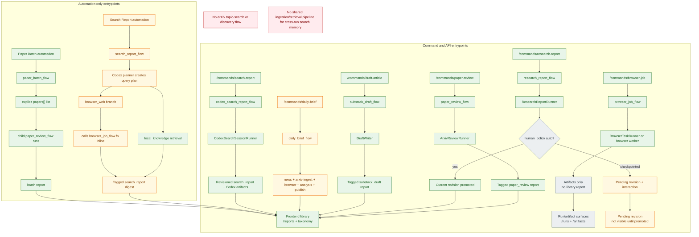

# Auto Mann

Auto Mann is a local Prefect-first automation stack for:

- daily brief generation
- paper review ingestion and summarization
- browser-assisted jobs
- revisioned research reports and publication artifacts

## Stack overview

- `apps/api`: FastAPI control plane for commands, runs, reports, and artifacts
- `apps/web`: official web frontend mounted by the API at `/`
- `apps/tui`: operator UI that submits commands and inspects outputs
- `flows/*`: Prefect flows and deployment wiring
- `workers/*`: typed adapters for ingestion, analysis, drafting, browser, Codex, research, and publishing jobs
- `libs/*`: shared contracts, DB helpers, retrieval + prompts, and GitHub publish utilities
- `infra/*`: legacy Postgres bootstrap references and Prefect-related infrastructure notes
- `scripts/*`: local stack setup and runtime helpers

Public API requests remain flow-oriented. Runner-specific worker contracts live in `libs/contracts/workers.py` and are used internally by flows when they hand work to adapters.

## Requirements

- Python 3.11+
- `bash`/`zsh` compatible shell

## Quick start

1. Create and activate a virtual environment, then install dependencies:

```bash
python3 -m venv .venv
source .venv/bin/activate
pip install -e ".[dev]"
```

If you are migrating an existing Postgres `life` database into SQLite, install the
optional migration dependencies instead:

```bash
pip install -e ".[dev,migration]"
```

If you plan to run browser automation workers, install browser runtime extras:

```bash
pip install -e ".[dev,browser]"
python -m playwright install chromium
```

2. Copy environment defaults:

```bash
cp .env.example .env
```

3. Start the full local stack. This bootstraps the local `life` SQLite database,
   starts Prefect against its own SQLite metadata file, registers deployments,
   launches the default worker, and starts the API:

```bash
scripts/setup_local_stack.sh
```

4. Open the operator tools:

- Web UI: `http://127.0.0.1:8000/`
- API Swagger: `http://127.0.0.1:8000/docs`
- Prefect UI: value of `LIFE_PREFECT_UI_URL` in `.env` (default `http://127.0.0.1:4200`)
- TUI:

```bash
source .venv/bin/activate
automann-tui
```

To shut everything down cleanly:

```bash
scripts/stop_local_stack.sh
```

Default database locations:

- `life`: `automann/runtime/life.db`
- Prefect metadata: `automann/runtime/prefect.db`

## Manual startup (optional)

The bootstrap script starts everything for convenience. For finer control:

```bash
source .venv/bin/activate
source .env
python -m scripts.bootstrap_life_system
scripts/run_prefect_server.sh
scripts/run_prefect_serve.sh
scripts/run_prefect_worker.sh mini-process process
scripts/run_api.sh
```

Useful script variants:

- `scripts/run_prefect_worker.sh browser-process process` for the browser lane
- `scripts/run_prefect_worker.sh mbp-process process` for ad hoc laptop workers

Explicit `browser-job` commands fail closed when Prefect/browser workers are unavailable; they do not run in API local fallback mode.

### Browser worker setup (CDP attach mode)

1. Start Chrome/Chromium with remote debugging enabled:

```bash
google-chrome \
  --remote-debugging-port=9222 \
  --user-data-dir="$PWD/automann/runtime/browser-profiles/default"
```

2. Ensure `LIFE_BROWSER_REMOTE_DEBUGGING_URL` is set (default in `.env.example`):

```bash
LIFE_BROWSER_REMOTE_DEBUGGING_URL=http://127.0.0.1:9222
```

3. Start the dedicated browser worker:

```bash
scripts/run_prefect_worker.sh browser-process process
```

## API commands

All writes are accepted by `POST /commands/*`; run history and artifacts are in
`/runs`, `/reports`, and `/artifacts`.

Examples:

```bash
curl -X POST http://127.0.0.1:8000/commands/daily-brief \
  -H "Content-Type: application/json" \
  -d '{"include_news":true,"include_arxiv":true,"publish":false}'

curl -X POST http://127.0.0.1:8000/commands/paper-review \
  -H "Content-Type: application/json" \
  -d '{"paper_id":"2206.12345","source_url":"https://arxiv.org/abs/2206.12345"}'

curl -X POST http://127.0.0.1:8000/commands/browser-job \
  -H "Content-Type: application/json" \
  -d '{"job_name":"seed-tracker","target_url":"https://example.com","capture_html":true,"capture_screenshots":true}'

curl -X POST http://127.0.0.1:8000/commands/browser-job \
  -H "Content-Type: application/json" \
  -d '{"job_name":"x-capture","target_url":"https://x.com/home","session":{"mode":"attach","cdp_url":"http://127.0.0.1:9222","profile_name":"main"},"steps":[{"op":"wait_for","selector":"main"},{"op":"screenshot","name":"timeline"}],"extract":[{"name":"first_post","selector":"article","kind":"text"}]}'

curl -X POST http://127.0.0.1:8000/commands/research-report \
  -H "Content-Type: application/json" \
  -d '{"theme":"Edge AI infrastructure","boundaries":["North America"],"areas_of_interest":["power supply","GPU lead times"],"report_key":"edge-ai","edit_mode":"merge","human_policy":{"mode":"auto"}}'

curl -X POST http://127.0.0.1:8000/commands/search-report \
  -H "Content-Type: application/json" \
  -d '{"prompt":"Create a 10 day Tokyo itinerary with neighborhoods, transit notes, and hotel-area tradeoffs."}'

curl -X POST http://127.0.0.1:8000/commands/search-report \
  -H "Content-Type: application/json" \
  -d '{"prompt":"Revise the itinerary for rain and move museums earlier in the trip.","resume_from_run_id":"<prior-search-run-id>"}'

curl -X POST http://127.0.0.1:8000/commands/draft-article \
  -H "Content-Type: application/json" \
  -d '{"source_report_id":"<research-report-id>"}'

curl http://127.0.0.1:8000/runs?limit=25
curl http://127.0.0.1:8000/reports?limit=25
curl http://127.0.0.1:8000/reports/<report-id>/revisions
curl http://127.0.0.1:8000/artifacts?limit=25
```

Request schemas and richer docs are available in the interactive FastAPI docs at
`/docs` and `/redoc`.

## Research report model

- `research-report` creates a logical report series keyed by `report_key`.
- Each run writes a new revision with revision metadata (`report_series_id`, `revision_number`, `supersedes_report_id`, `is_current`).
- Revisions always emit Markdown and JSON artifacts, and emit CSV artifacts when tabular findings are present.
- `draft-article` now prefers `source_report_id` or `source_revision_id` so publication drafts can be generated from a stored research revision.

## Search report model

- `search-report` is the manual operator lane for Codex-backed web research sessions.
- Each run persists a `search_report` revision plus report Markdown, resume memo, session manifest, and raw event-stream artifacts.
- Fresh runs create a new lineage key of the form `search-report:<run-id>`; resumes reuse the earlier lineage when `resume_from_run_id` points at a prior manual search-report run.
- Resume precedence is: prior run's saved Codex session from `resume_from_run_id`, then explicit `codex_session_id`; if the saved session is missing or resume fails, the flow falls back to a fresh Codex run seeded from the saved memo.
- Manual `search-report` revisions auto-promote immediately in v1; there is no checkpoint gate on this lane yet.

## Browser job model

- `browser-job` accepts structured browser execution inputs for `session`, `steps`, and `extract`.
- `session.mode` supports `launch` and `attach`; attach mode uses a loopback CDP endpoint such as `http://127.0.0.1:9222`.
- `steps` support typed browser ops including `wait_for`, `click`, `fill`, `press`, `scroll`, and `screenshot`.
- `extract` supports typed extraction for `text`, `html`, `links`, and `attribute`.
- Successful browser runs can emit HTML, screenshots, traces, extraction JSON, and metadata artifacts under `data/runtime/artifacts/...`.
- CSV artifacts are previewable through `/artifacts/{id}/preview`.

## Current Pipeline Status

The codebase now has several real end-to-end report paths, but not every activity type is wired from every operator surface, and a few lanes are still intentionally documented here as degraded.

- `paper-review` is working end to end from `POST /commands/paper-review` to a persisted tagged report in the frontend library.
- `research-report` is working end to end as a revisioned analysis flow; checkpointed runs pause for promotion before the new revision becomes current.
- `search-report` is working end to end as a manual command from `POST /commands/search-report` to a persisted tagged revisioned report; it resumes from saved Codex session state when available and falls back to memo-seeded continuation when it is not.
- `search-report` automation still exists as a degraded digest lane; it plans queries, recalls local knowledge, and can touch the browser branch, but it is not yet a dedicated shared-ingestion/retrieval pipeline and its browser branch still runs inline.
- `paper-batch` works as an automation for an explicit `papers[]` list; it is not an arXiv topic-discovery pipeline.
- `browser-job` works as an explicit command and requires the browser worker, but it produces run artifacts rather than a library report.
- `daily-brief` still has known degraded behavior called out below.



## Open Items

These review findings are still open and should be treated as current known gaps:

- `daily-brief` currently ignores `include_news`, `include_arxiv`, and `include_browser_jobs`; all three lanes still run.
- The `daily-brief` browser lane currently runs inline with a placeholder target instead of going through the dedicated `browser-process` fail-closed path used by explicit `browser-job` commands.
- A `daily-brief` parent run can still be marked `completed` even if a child lane fails, so top-level status may under-report degraded runs.
- `browser-job` accepts `session.profile_name`, but attach mode still reuses the first exposed browser context and does not yet use the profile label to select a context.
- Manual `search-report` is intentionally a thin Codex session wrapper in v1; it does not yet ingest discovered sources into shared chunk retrieval or a reusable knowledge base.
- Automation `search_report_flow` still uses the older planner-plus-digest shape and its browser lane still calls `browser_job_flow.fn(...)` inline instead of crossing the dedicated browser-worker boundary.
- `research-report` callers should avoid whitespace-only `report_key` values until server-side normalization is tightened to reject or derive a non-empty lineage key.

## Repository pointers

- [Architecture notes](docs/architecture.md)
- [Implementation TODOs](docs/IMPLEMENTATION_TODO.md)
- [SQLite cutover runbook](docs/sqlite-cutover.md)
- [Flow registry](flows/registry.py)
- [TUI and bridges](apps/tui/main.py)

## Development checks

- Run tests:

```bash
python3 -m pytest
```

- Smoke compile check:

```bash
python3 -m compileall apps libs workers flows scripts
```

Common commands exposed by the package:

- `automann-api` (starts `apps.api.main:run`)
- `automann-tui` (starts `apps.tui.main:main`)
